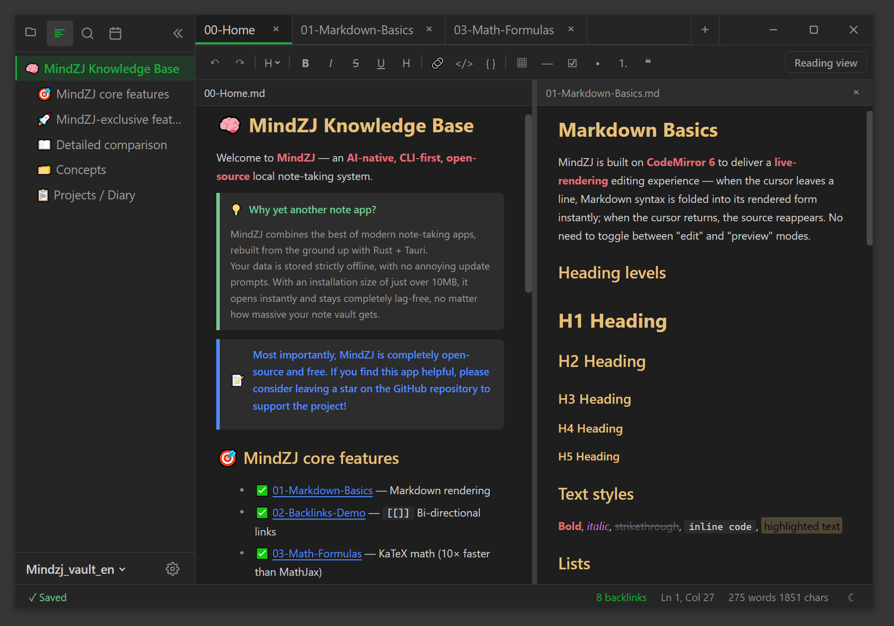
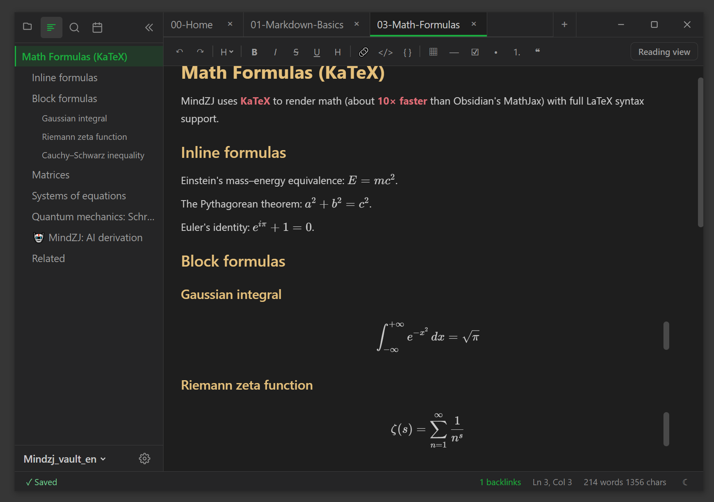
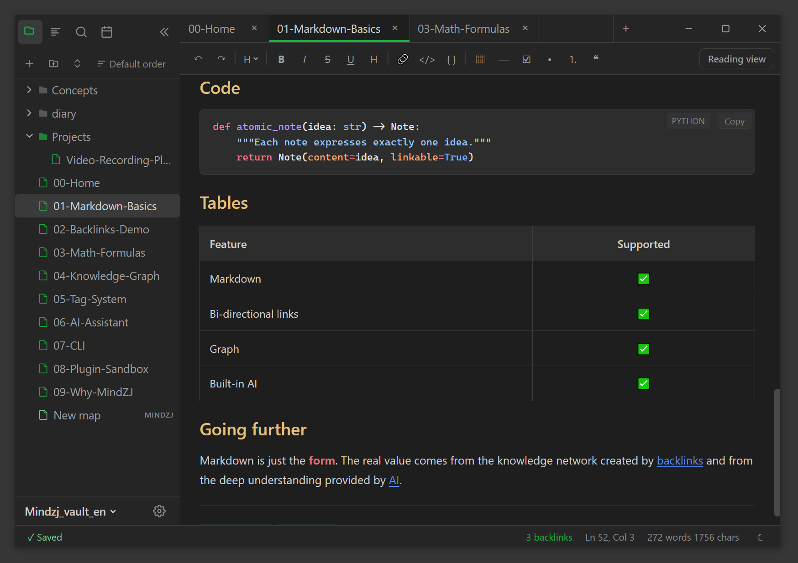
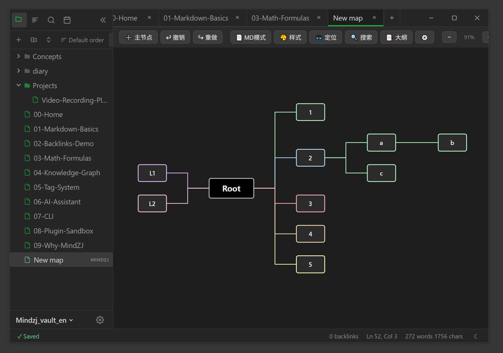
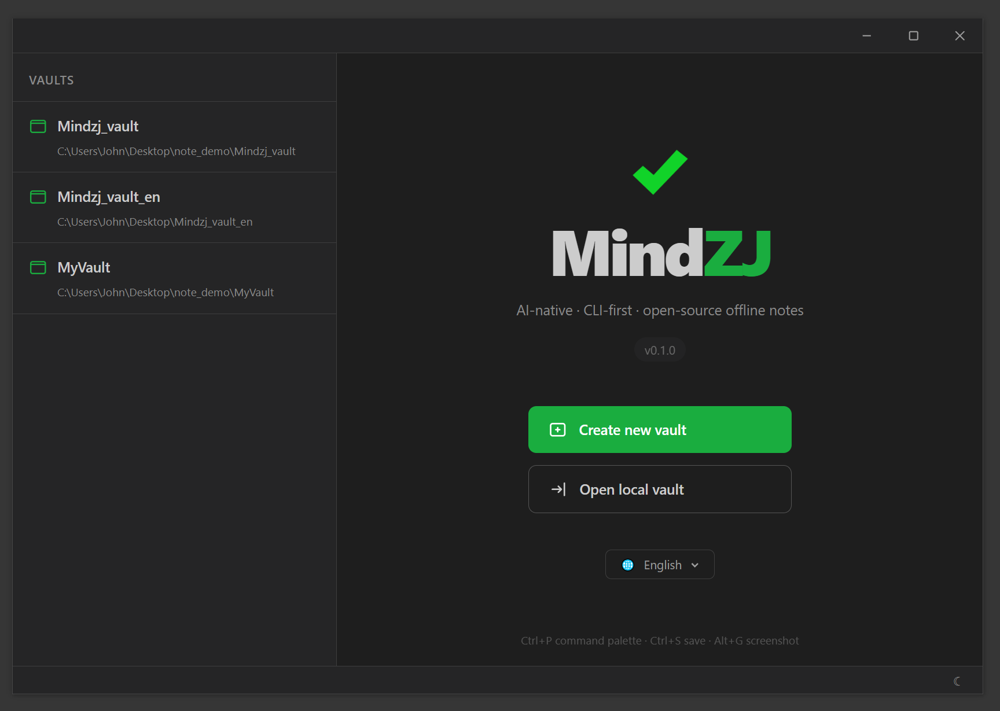

<h1 align="center">
  <br>
  MindZJ — Eine quelloffene Offline-Notiz-App mit nativer KI und CLI.
</h1>

<p align="center">
  <em>Eine vollständig quelloffene lokale Notizanwendung, die das Beste aus <a href="https://obsidian.md">Obsidian</a> übernimmt und bei KI-Integration, CLI-Workflows und Plugin-Sandboxing einen Schritt weiter geht.</em>
</p>

<p align="center">
  <a href="#funktionen">Funktionen</a> •
  <a href="#installation">Installation</a> •
  <a href="#schnellstart">Schnellstart</a> •
  <a href="#tastaturkürzel">Kürzel</a> •
  <a href="#cli">CLI</a> •
  <a href="#entwicklung">Entwicklung</a> •
  <a href="#lizenz">Lizenz</a>
</p>
<p align="center">
  
  
  
  
</p>

<p align="center">
  <strong>🌐 Weitere Sprachen:</strong>
  <a href="../README.md">English</a> |
  <a href="README_ZH.md">中文</a> |
  <a href="README_JA.md">日本語</a> |
  <a href="README_FR.md">Français</a> |
  <a href="README_DE.md">Deutsch</a> |
  <a href="README_ES.md">Español</a>
</p>

---

<p align="center">
  <a href="https://www.buymeacoffee.com/superjohn">
    
  </a>
  &nbsp;
  <a href="https://ko-fi.com/superjohn">
    
  </a>
  &nbsp;
  <a href="https://paypal.me/TanCat997">
    
  </a>
</p>

<p align="center">Wenn dir MindZJ gefällt, erwäge bitte das Projekt zu unterstützen</p>

---

## Vorschau

<p align="center">
  
  <br/>
  <em>Hauptoberfläche</em>
</p>

<p align="center">
  
  <br/>
  <em>Mathematische Formeln</em>
</p>

<p align="center">
  
  <br/>
  <em>Markdown-Grundlagen</em>
</p>

<p align="center">
  
  <br/>
  <em>Plugins</em>
</p>

<p align="center">
  
  <br/>
  <em>Welcome</em>
</p>

<p align="center">
  
  <br/>
  <em>Markdown-Bearbeitung mit Live-Vorschau, Backlinks und Befehlspalette</em>
</p>

---

## Funktionen

### Kern

- **Vollständig offline, lokal zuerst** — MindZJ ist eine komplett offline arbeitende Notiz-App. Jede Notiz ist eine einfache `.md`-Datei in deinem Vault auf deiner eigenen Festplatte, sämtliche Daten bleiben lokal und werden niemals auf irgendeinen Server hochgeladen
- **KI-nativer Kernel** — Ollama (offline), Claude und OpenAI sind direkt im Rust-Kernel integriert
- **CLI-first** — ein vollständiges Kommandozeilen-Interface, perfekt für Pipes, Skripte und KI-Tool-Ketten
- **Leichtgewichtig** — gebaut auf Tauri 2.0 (~10 MB Installer) statt Electron (~150 MB)
- **Plattformübergreifend** — Windows, macOS, Linux, iOS und Android aus einer Codebasis
- **Plugin-Sandbox** — Plugins laufen in WebWorkern mit deklarativen Berechtigungen, sicherer als Obsidian

### Bearbeitung

- **Drei Modi** — Live-Vorschau, Quellcode und Lesen, mit `Ctrl+E` sofort umschaltbar
- **Vollständiges Markdown** — Überschriften, Listen, Tabellen, Codeblöcke, Mathe (KaTeX), Callouts, Mermaid
- **Intelligente Listenfortsetzung** — `Enter` setzt die Liste fort, `Tab` / `Shift+Tab` zum Ein-/Ausrücken
- **Bilder einfügen** — Bilder aus der Zwischenablage werden im Vault gespeichert und automatisch verlinkt
- **Atomares Speichern** — Schreibe in Temp-Datei → fsync → rename, kein Datenverlust bei Stromausfall
- **Snapshots** — jede Änderung erzeugt einen Snapshot mit Zeitstempel, jederzeit zurückrollbar

### Navigation

- **Wiki-Links** — `[[note]]`-Syntax mit Autovervollständigung und Backlink-Übersicht
- **Gliederungsansicht** — per Klick zu jeder Überschrift springen
- **Volltextsuche** — angetrieben von der Rust-Bibliothek `tantivy`, auch bei großen Vaults sofort
- **Befehlspalette** — `Ctrl+P` startet jede Aktion
- **Tabs & Splits** — Rechtsklick auf einen Tab teilt nach rechts, links, oben oder unten
- **Dateibaum** — Drag & Drop, eigene Sortierung, angepinnte Ordner

### Mind Maps

- **Natives `.mindzj`-Format** — ein dedizierter Mind-Map-Editor ist als eingebautes Plugin enthalten
- **Regenbogen-Verbindungen, Drag & Drop, Copy / Cut / Paste** — alle Funktionen des eigenständigen MindZJ-Plugins sind hier ebenfalls verfügbar

### Internationalisierung

- **6 Sprachen ab Werk** — English, 简体中文, 日本語, Français, Deutsch, Español

### Anpassung

- **Themes** — Hell / Dunkel / System, mit CSS-Variablen pro Vault überschreibbar
- **Tastenkürzel** — jede Aktion im Visual-Recorder in den Einstellungen neu belegen
- **Plugins** — Community-Plugins installieren oder eigene über die Obsidian-kompatible API schreiben

---

## Installation

### Vorgefertigte Binaries

> _Kommt in Kürze — neuester Installer auf [GitHub Releases](https://github.com/zjok/mindzj/releases)._

### Aus dem Quellcode bauen

```bash
git clone https://github.com/zjok/mindzj.git
cd mindzj
npm install
npm run tauri:build
```

Das Artefakt landet in `src-tauri/target/release/bundle/`.

### Voraussetzungen

- [Rust](https://rustup.rs/) ≥ 1.77
- [Node.js](https://nodejs.org/) ≥ 20 LTS
- [Tauri-2.0-Voraussetzungen](https://v2.tauri.app/start/prerequisites/)

---

## Schnellstart

1. Starte MindZJ und wähle einen Ordner als Vault
2. Drücke `Ctrl+N`, um eine neue Notiz zu erstellen, oder lege bestehende `.md`-Dateien in den Vault
3. Einfach tippen — Markdown wird live dargestellt
4. Nutze `[[wiki-link]]`, um Notizen untereinander zu verknüpfen
5. Öffne die Befehlspalette mit `Ctrl+P`, um jede Aktion zu finden
6. Modus umschalten mit `Ctrl+E` — Live-Vorschau → Quellcode → Lesen → Live-Vorschau
7. Einstellungen mit `Ctrl+,` öffnen und alles nach Geschmack anpassen

---

## Tastaturkürzel

Alle Kürzel sind in **Einstellungen → Hotkeys** neu belegbar.

| Aktion           | Standard                |
| ---------------- | ----------------------- |
| Neue Notiz       | `Ctrl + N`              |
| Speichern        | `Ctrl + S`              |
| Befehlspalette   | `Ctrl + P`              |
| Modus umschalten | `Ctrl + E`              |
| Seitenleiste     | `Ctrl + \``             |
| Einstellungen    | `Ctrl + ,`              |
| Vault-Suche      | `Ctrl + Shift + F`      |
| In Notiz suchen  | `Ctrl + F`              |
| Aufgabenliste    | `Ctrl + L`              |
| Fett             | `Ctrl + B`              |
| Kursiv           | `Ctrl + I`              |
| Inline-Code      | `Ctrl + Shift + E`      |
| Überschrift 1–6  | `Ctrl + 1` … `Ctrl + 6` |
| Editor-Textzoom  | `Ctrl + Mausrad`        |
| UI-Zoom          | `Ctrl + =` / `Ctrl + -` |
| Screenshot       | `Alt + G`               |

---

## CLI

MindZJ liefert ein eigenständiges `mindzj`-CLI mit, das denselben Rust-Kernel wie die Desktop-App verwendet.

```bash
# Vault öffnen
mindzj vault open ~/my-notes

# Notizen erstellen, auflisten, suchen, lesen
mindzj note create "Meine neue Notiz"
mindzj note list
mindzj note search "Stichwort"
mindzj note read "Meine neue Notiz" | grep "TODO"

# KI-Integration
mindzj config api-key create
mindzj ai ask "Wie steht mein Projekt?"
```

Jede Kernel-Operation, die in der Oberfläche möglich ist, ist auch per CLI erreichbar — ideal für Skripting, Massenimporte und KI-Tool-Ketten.

---

## Architektur

1. **Kernel / UI streng getrennt** — jede Dateioperation läuft über den Rust-Kernel
2. **Atomares Schreiben** — `Temp-Datei → fsync → rename`, überlebt Stromausfälle
3. **Path-Traversal-Schutz** — jeder Pfad wird gegen die Vault-Wurzel validiert
4. **Automatische Snapshots** — jede Änderung wird gesichert, jederzeit rückgängig
5. **Plugin-Sandbox** — Plugins laufen in WebWorkern mit explizitem Permissions-Manifest

```
mindzj/
├── src-tauri/            # Rust-Backend (Kernel + Tauri-Commands)
│   └── src/
│       ├── kernel/       # Kern: vault, links, search, snapshots
│       └── api/          # Tauri-Command-Handler
├── src/                  # SolidJS-Frontend
│   ├── components/       # UI-Komponenten
│   ├── stores/           # Reaktiver Zustand
│   └── plugin-api/       # Plugin-API-Typen
├── cli/                  # Eigenständiges Rust-CLI
└── docs/                 # Dokumentation
```

### Technologie-Stack

| Ebene            | Technologie                  |
| ---------------- | ---------------------------- |
| Desktop / Mobile | Tauri 2.0 (Rust + WebView)   |
| Frontend         | SolidJS + TypeScript         |
| Editor           | CodeMirror 6                 |
| Styling          | UnoCSS + CSS-Variablen       |
| Suche            | tantivy (Rust-Volltextsuche) |
| CLI              | Rust (clap)                  |

---

## Entwicklung

```bash
# Abhängigkeiten installieren
npm install

# Vollständige Tauri-Dev-App starten (Rust-Backend + Vite + HMR)
npm run tauri:dev

# Nur das Frontend
npm run dev

# Typprüfung
npm run typecheck

# Produktions-Build
npm run tauri:build
```

---

## Unterstützung

Wenn dir MindZJ gefällt, erwäge bitte das Projekt zu unterstützen:

<p align="center">
  <a href="https://www.buymeacoffee.com/superjohn">
    
  </a>
  &nbsp;
  <a href="https://ko-fi.com/superjohn">
    
  </a>
  &nbsp;
  <a href="https://paypal.me/TanCat997">
    
  </a>
</p>

---

## Lizenz

Dieses Projekt steht unter der [GNU Affero General Public License v3.0](../LICENSE) (AGPL-3.0-or-later).

---

<p align="center">
  Mit ❤️ gebaut von <strong>SuperJohn</strong> · 2026.04
</p>
